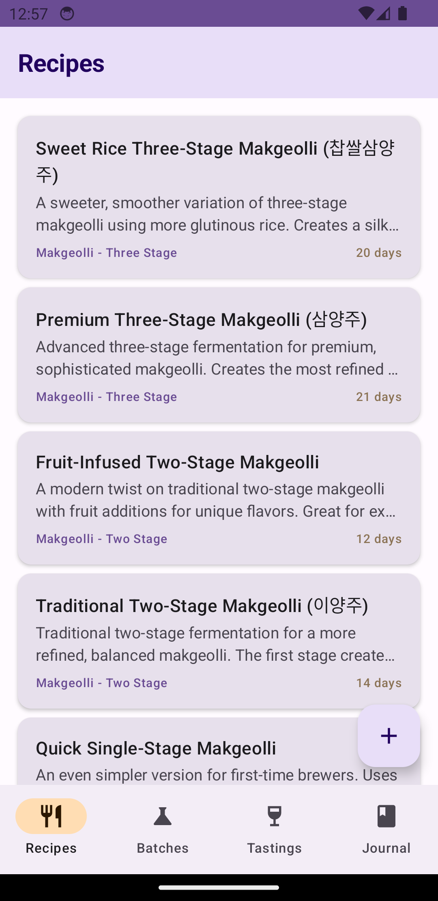
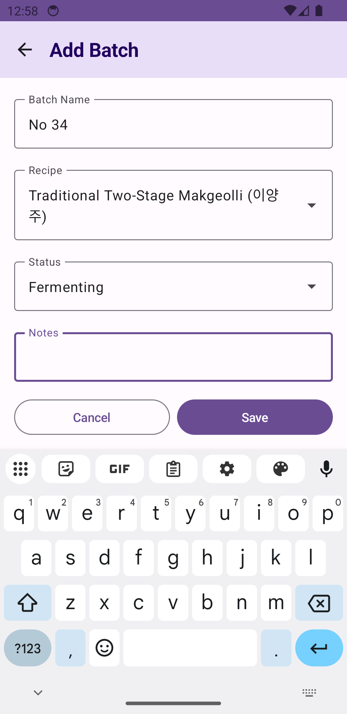

# TakTak - Korean Fermentation Companion

TakTak is a comprehensive Android application designed for home brewers of makgeolli and other Korean ferments. The app helps you manage recipes, track batches, record tasting notes, and maintain a detailed fermentation journal.

## Screenshots

<p align="center">
  
  
  
</p>

## Features

### 🍶 Recipe Management
- Create and store your favorite fermentation recipes
- Organize recipes by category (Makgeolli, Kimchi, etc.)
- Track ingredients, instructions, and fermentation times
- Edit and delete recipes as needed

### 🧪 Batch Tracking
- Start new batches from your saved recipes
- Monitor batch status (Fermenting, Aging, Complete, Failed)
- Track start dates and expected completion dates
- Add notes to document your brewing process

### 🍷 Tasting Notes
- Record detailed tasting notes for each batch
- Evaluate appearance, aroma, taste, and mouthfeel
- Rate batches with a 5-star system
- Build a history of your brewing refinements

### 📔 Fermentation Journal
- Document your brewing journey with journal entries
- Link entries to specific batches
- Add tags for easy organization
- Track experiments and observations

## Technology Stack

- **Language**: Kotlin
- **UI Framework**: Jetpack Compose with Material Design 3
- **Architecture**: MVVM (Model-View-ViewModel)
- **Database**: Room (SQLite)
- **Asynchronous Programming**: Kotlin Coroutines & Flow
- **Navigation**: Jetpack Navigation Compose

## Project Structure

```
app/
├── data/
│   ├── dao/              # Data Access Objects
│   ├── database/         # Room Database setup
│   ├── model/            # Data models (entities)
│   └── repository/       # Repository pattern
├── ui/
│   ├── components/       # Reusable UI components
│   ├── navigation/       # Navigation setup
│   ├── screens/          # Feature screens
│   │   ├── batches/
│   │   ├── journal/
│   │   ├── recipes/
│   │   └── tastings/
│   └── theme/            # Material Design theme
└── MainActivity.kt       # App entry point
```

## Requirements

- Android SDK 26 (Android 8.0) or higher
- Target SDK 34 (Android 14)
- Kotlin 1.9.20
- Gradle 8.2.0

## Building the Project

1. Clone the repository
```bash
git clone https://github.com/csabiu/TakTak.git
cd TakTak
```

2. Open the project in Android Studio

3. Sync Gradle files

4. Run the app on an emulator or physical device

## Database Schema

The app uses a relational database with the following entities:

- **Recipe**: Stores recipe information including ingredients and instructions
- **Batch**: Tracks individual batches linked to recipes
- **TastingNote**: Records sensory evaluations of batches
- **JournalEntry**: Stores general journal entries, optionally linked to batches

## Contributing

Contributions are welcome! Please feel free to submit a Pull Request.

## License

This project is licensed under the Apache License 2.0 - see the LICENSE file for details.

## Acknowledgments

Built with ❤️ for the home brewing community, with special appreciation for the rich tradition of Korean fermentation.
